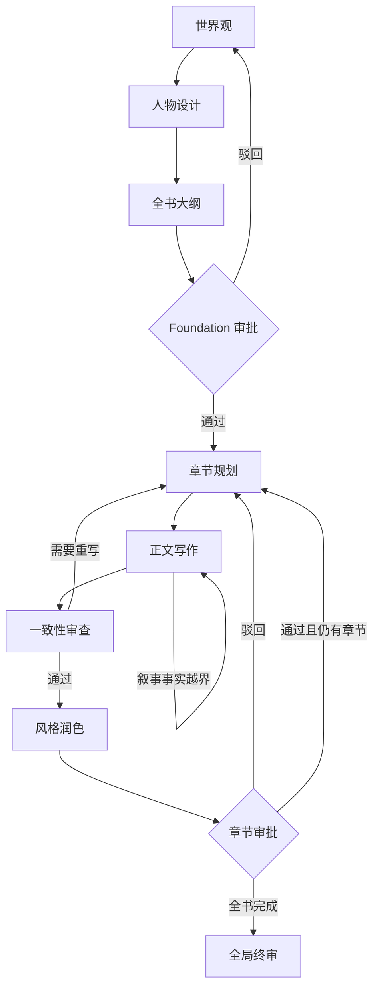

# GraphNovel

GraphNovel（番茄小说工坊）是一个面向中文网络小说创作的 AI 辅助写作系统。它使用 Graph Engineering 组织世界观、人物、大纲、章节规划、正文写作、一致性审查、风格润色、人工审批和全局终审，让长篇创作过程具备可追踪的状态、明确的质量门和可恢复的检查点。

项目提供本地 Web 界面和 CLI，默认通过 OpenAI SDK 调用 DeepSeek 兼容接口。

## Graph Engineering

GraphNovel 不是简单的 Prompt 串联。核心运行语义包括：

| 概念 | 在项目中的职责 |
| --- | --- |
| Node | 每个创作阶段由职责单一的 Agent 节点处理 |
| State | `GraphNovelState` 是跨节点共享并持久化的唯一事实来源 |
| Edge | 引擎根据输出契约、审核结果和人工决定选择下一条路径 |
| Gate | Foundation 和章节正文都必须经过可持久化的人工审批门 |
| Loop | 审稿失败、事实越界和人工驳回会进入有上限的反馈重写循环 |
| Checkpoint | 关键状态转换后保存项目，进程重启后可以恢复 |



## 主要能力

- 生成并审批世界观、人物阵容和全书章节大纲。
- 以批次生成长篇大纲，避免一次响应承载全部章节。
- 为每章建立因果链、前置事实、角色信息来源和连续性约束。
- 追踪 Narrative State：已批准事实、角色认知、时间地点、状态和资源。
- 拦截未规划事实、知识越权、缺乏信息来源和连续性冲突。
- 在批准前隔离候选稿的事实与副作用，避免失败稿污染后续章节。
- 使用结构化输出契约和有限重试处理模型格式错误。
- 保存节点生命周期、条件边选择、错误状态和执行记录。
- 导出已批准章节及完整小说 Markdown。

## 技术栈

- Python 3.9
- Flask 与 Jinja2
- OpenAI Python SDK（兼容自定义 Base URL）
- dataclass 与 JSON 状态持久化
- `unittest.mock` 与 Flask test client

## 快速开始

### 1. 克隆并安装

```bash
git clone https://github.com/nssntus/graph-novel.git
cd graph-novel

python3 -m venv .venv
source .venv/bin/activate
pip install -r requirements.txt
```

### 2. 配置环境

```bash
cp .env.example .env
```

在 `.env` 中填写真实的 API Key，并确认模型名称是供应商当前支持的值：

```dotenv
DEEPSEEK_API_KEY=your-deepseek-api-key-here
DEEPSEEK_BASE_URL=https://api.deepseek.com
DEEPSEEK_MODEL=deepseek-v4-pro
```

`.env` 已加入 `.gitignore`，不要将任何真实密钥提交到版本库。

常用可选配置：

| 环境变量 | 用途 |
| --- | --- |
| `GRAPH_NOVEL_DIR` | 小说项目存储目录，默认 `~/GraphNovel_Projects` |
| `FLASK_SECRET_KEY` | Flask 会话密钥；非本地环境必须显式设置 |
| `PORT` | Web 服务端口，默认 `5500` |
| `FLASK_DEBUG` | 是否启用 Flask 调试模式，默认 `1` |
| `GRAPH_NOVEL_LLM_DEBUG_FILE` | 可选的本地 LLM JSONL 诊断文件 |

### 3. 启动 Web 界面

```bash
python3 web_server.py
```

打开 [http://127.0.0.1:5500](http://127.0.0.1:5500)。

### 4. 使用 CLI

```bash
python3 -m graph_novel.cli \
  --title "示例小说" \
  --genre fantasy \
  --chapters 20 \
  --notes "快节奏成长与团队建设"
```

无人值守运行可以增加 `--auto-approve`，但这会跳过所有人工审批门，不建议用于正式内容生产。

## 项目结构

```text
graph_novel/
├── state.py              # State 数据模型、序列化与迁移
├── engine.py             # 图调度、条件边、Gate 和重写循环
├── narrative.py          # 事实、角色认知与连续性校验
├── output_contracts.py   # LLM 结构化输出契约
├── llm.py                # 统一模型调用适配层
├── exporting.py          # 已批准内容导出
├── nodes/                # 各创作与审查节点
└── web/                  # Flask API、模板和静态资源

tests/test_integration.py # Mock LLM 集成回归套件
web_server.py             # Web 启动入口
```

## 测试

```bash
python3 tests/test_integration.py
```

常规测试会 Mock LLM，不会产生真实 API 费用。测试覆盖状态序列化、输出契约、图路由、审批 Gate、失败恢复、重写上限、Narrative State、Web API 和完整 Mock 工作流。

## 数据与安全

- 小说正文、人物设定和创作状态默认保存在本机项目目录，不应提交到本仓库。
- API Key 只应通过环境变量或未跟踪的 `.env` 提供。
- LLM 调试日志可能包含 Prompt、模型响应和小说内容，启用后应保存在受控的本地路径。
- 默认 Flask 配置只适合本地开发；对外部署前必须关闭调试模式并设置独立的 `FLASK_SECRET_KEY`。
- 对模型输出始终执行结构校验，但生成内容仍需要人工审阅。

## 当前边界

- 这是本地开发项目，不包含生产级部署、身份认证或多租户隔离。
- 模型可用性、名称和能力由外部供应商决定，运行前应核对当前 API 文档。
- 长篇小说质量仍受模型、上下文长度和人工反馈质量影响。
- 只有通过人工审批的章节才会提交叙事状态并进入正式导出。
