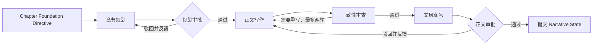

# GraphNovel

> 让 AI 不只是继续写，而是记得故事为什么走到这里。

GraphNovel（番茄小说工坊）是一套面向中文长篇小说的本地 AI 创作系统。它将设定、人物、关系、故事结构、章节规划、正文生成、一致性审查与人工决策组织成一张可执行的图，并把 `GraphNovelState` 作为跨节点、跨进程恢复的唯一事实来源。

这不是一组 Prompt，也不是自动接龙脚本。模型负责生成和审查，Graph Engine 负责状态、路由与停止条件，作者在关键 Gate 上决定是否继续。

[快速开始](#快速开始) · [理解工作流](#创作工作流) · [迁移旧项目](#迁移旧-python-项目) · [运行测试](#开发与验证)

## 重构后的系统

当前主路径已经完整迁移到 Node.js、TypeScript 和 Pi Agent 运行时：

- React + Vite 本地工作台：项目库、创作台、内容库、运行中心和试读中心。
- Node HTTP API 与 SSE：耗时任务在后台执行，页面实时接收节点和任务状态。
- CLI 与 Web 共用 `GraphNovelService`：两种入口遵循同一套校验、持久化和图语义。
- 自有 Graph Engine：管理 Node、Edge、Gate、Loop、失败状态和恢复路径。
- 原子 JSON checkpoint：项目锁、临时文件替换和进程重启恢复，避免并发覆盖。
- Pi Agent Core / Pi AI：统一执行生成节点，并对每个结构化输出做契约校验。
- 旧 Python State 迁移器：先预览并生成报告，再备份源存档并写入新 schema。

旧 Python/Flask runtime 已退出仓库，不再是 Web、CLI、测试或生产路径。

## 创作工作流

### 1. 建立 Foundation

Foundation 不是一份大纲，而是一组有依赖、有版本、有稳定 ID 的创作资产：

1. 创作章程
2. 世界设定集
3. 角色设定集
4. 关系与揭示计划
5. 故事结构纲要
6. 节奏、伏笔与揭示表
7. 全书章节纲要
8. 文风与叙事规范
9. 开篇连续性基线

系统会为角色、地点、势力、能力、规则、秘密、事实、故事阶段和伏笔建立 Foundation Registry，并记录文档依赖及输入/输出哈希。代码先检查唯一事实来源、跨文档引用、文档新鲜度和揭示时序，随后再由 Agent 做语义一致性审查。

校验失败会回到最早产生问题的节点；确定性校验与语义审查共享最多两轮自动回写预算。全部通过后，流程停在 Foundation 人工审批 Gate；批准时生成带哈希的快照，后续章节只能读取与该快照一致的 Foundation。

### 2. 按章规划和写作

每章开始前，系统从批准快照裁剪出 `Chapter Foundation Directive`。它只包含本章相关的角色、地点、规则、故事阶段、秘密揭示、伏笔与文风要求，并带有可验证的哈希。

章节管线随后依次执行：



规划会明确前章承接、因果链、前置事实、计划新增事实和信息来源。正文、审查与润色必须回传同一个 Directive 哈希和连续性上下文哈希；润色只能改善表达，不能改写受保护的事实或角色认知。

候选稿在人工批准前不会修改正式 Narrative State。只有批准后的事实、角色认知、时间地点、角色状态、资源与伏笔才会进入后续章节上下文。自动重写次数耗尽后，工作台允许作者手动修订候选稿并重新进入审查，同时保留历史版本。

### 3. 完成和终审

全部目标章节批准后，可以运行全局终审。正式导出只包含已批准章节；候选稿、失败稿和未提交的叙事副作用不会混入成稿。

## Graph Engineering

| 概念 | 在 GraphNovel 中的职责 |
| --- | --- |
| Node | 职责单一的生成、审查、润色或审批节点 |
| State | `GraphNovelState`，跨节点共享并持久化的唯一事实来源 |
| Edge | 根据节点结果和 State 条件选择下一条路径 |
| Gate | 保存 checkpoint 后暂停，等待作者批准或驳回 |
| Loop | 携带审查问题或人工反馈、有明确上限的重写循环 |
| Checkpoint | 关键状态转换后的原子持久化，可在进程重启后恢复 |

Graph Engine 会记录节点的 `pending`、`in_progress`、`completed`、`failed` 或 `skipped` 状态以及路由事件。失败不会伪装成成功；同一项目同时只允许一个后台任务写入。

## Web 工作台

启动后可使用以下视图：

- 项目库：创建、搜索和进入小说项目。
- 项目总览：查看当前阶段、下一步、待审批 Gate 和最近错误。
- 创作台：生成和审批 Foundation、章节规划、正文与全局终审。
- 内容库：集中阅读设定资料、章节文稿与审稿记录，并编辑章节规划、候选稿和已批准正文。
- 运行中心：通过 SSE 查看实时任务、节点状态和执行事件。
- 试读中心：按章节阅读所有已批准正文。
- 「小番」创意助手：在项目外自由讨论，或基于当前项目的只读 State 提供建议；聊天不会直接修改 State。

## 快速开始

### 环境要求

- Node.js `>= 22.19.0`
- npm
- 一个可用的 DeepSeek OpenAI-compatible API 凭据，仅在需要生成内容时使用

### 安装与启动

```bash
git clone https://github.com/nssntus/graph-novel.git
cd graph-novel
npm ci
npm run dev
```

打开 [http://127.0.0.1:5500](http://127.0.0.1:5500)。Web 默认只监听本机回环地址。

没有 API Key 时，项目管理、已批准内容阅读和导出仍可使用；需要 Agent 的命令会明确返回 `agent_unavailable`，不会写入占位内容或伪造成功。

### 模型配置

需要生成内容时，再复制配置模板并将占位值替换为真实凭据：

```bash
cp .env.example .env
```

```dotenv
DEEPSEEK_API_KEY=your-deepseek-api-key-here
DEEPSEEK_BASE_URL=https://api.deepseek.com
DEEPSEEK_MODEL=your-supported-model-id
```

模型 ID 和能力由供应商决定，请按当前供应商文档设置 `DEEPSEEK_MODEL`。仓库中的默认值只是运行时配置，不代表该模型当前一定可用。

| 环境变量 | 默认值 | 说明 |
| --- | --- | --- |
| `GRAPH_NOVEL_DIR` | `./.graphnovel-data` | 项目 checkpoint 目录 |
| `PORT` | `5500` | 本地 Web 端口 |
| `DEEPSEEK_BASE_URL` | `https://api.deepseek.com` | OpenAI-compatible endpoint |
| `DEEPSEEK_MODEL` | `deepseek-v4-pro` | 交给 Pi provider 的模型 ID |
| `DEEPSEEK_TIMEOUT_SECONDS` | `120` | 单次请求超时，允许 1-600 秒 |
| `DEEPSEEK_API_RETRIES` | `2` | provider 请求重试，允许 0-5 次 |
| `DEEPSEEK_THINKING` | `disabled` | `enabled` 或 `disabled` |
| `DEEPSEEK_REASONING_EFFORT` | `high` | Thinking 开启时使用 `high` 或 `max` |

外部环境变量优先于项目根目录 `.env`。API Key 只用于 Pi provider 认证，不会写入项目 State。

## CLI

CLI 与 Web 使用同一项目目录和 Service：

```bash
npm run cli -- create \
  --project-id demo \
  --title "示例小说" \
  --genre "科幻" \
  --chapters 20

npm run cli -- list
npm run cli -- state --project-id demo
npm run cli -- export --project-id demo --kind novel
```

生成和审批命令包括：

```text
foundation-generate
foundation-decision
chapter-plan
chapter-plan-decision
chapter-writing
chapter-writing-decision
global-review
```

驳回 Foundation、章节规划或正文时必须提供 `--feedback`。例如：

```bash
npm run cli -- chapter-plan-decision \
  --project-id demo \
  --chapter 1 \
  --approved false \
  --feedback "开篇冲突太晚，第一场景就要触发。"
```

## 迁移旧 Python 项目

迁移分为只读预览和显式写入。先查看兼容性报告：

```bash
npm run cli -- migration-preview \
  --source /path/to/legacy_state.json
```

确认后写入新的项目目录：

```bash
npm run cli -- migration-write \
  --source /path/to/legacy_state.json \
  --dir ./.graphnovel-data
```

写入时会在目标目录保留一份 `<project-id>.legacy.json` 源存档副本，再创建新 checkpoint。若预览状态是 `requires_review`，必须人工确认后增加 `--allow-review true`；命令不会覆盖源 JSON。

仓库自带的《循环之外》是旧 schema 示例，可直接用来验证迁移器：

```bash
npm run cli -- migration-preview \
  --source examples/xunhuan-zhi-wai/xunhuan-zhi-wai_state.json
```

当前预览会识别 5 个已批准章节、5 条 Narrative Fact 和 5 条角色认知记录。要在新工作台查看它，先将其迁移到单独目录，再用同一目录启动 Web：

```bash
npm run cli -- migration-write \
  --source examples/xunhuan-zhi-wai/xunhuan-zhi-wai_state.json \
  --dir /tmp/graphnovel-example

GRAPH_NOVEL_DIR=/tmp/graphnovel-example npm run dev
```

示例说明见 [`examples/README.md`](examples/README.md)。迁移后的旧 Foundation 可以在 Web 创作台通过专用升级图补齐 Registry、文档哈希和批准快照；升级前系统会再创建本地回退备份，并保留已批准正文与 Narrative State。

## 项目结构

```text
frontend/                 # React、Vite、Tailwind 与本地创作工作台
src/
├── agents/               # Foundation、章节、创意对话和终审 Agent
├── checkpoint/           # 原子 JSON checkpoint、备份与项目锁
├── contracts/            # Agent 结构化输出契约和校验
├── graph/                # Graph Engine、Edge、Gate 和 Loop
├── migration/            # 旧 Python State 预览、迁移与报告
├── runtime/              # Pi Agent 运行时、模型配置与契约重试
├── state/                # GraphNovelState、Registry 和连续性逻辑
├── web/                  # HTTP API、SSE 与共用 Service
├── cli.ts                # CLI 入口
└── web-server.ts         # Web 入口

test/                     # Node Test Runner 与 Mock Pi Agent 回归测试
examples/                 # 旧 schema 示例及迁移验证数据
```

项目数据默认位于 `./.graphnovel-data`，不保存在 `dist/`。关键状态转换后会写入 checkpoint，因此 Web 进程重启后可以继续。

## 开发与验证

```bash
npm run typecheck
npm test
npm run migration:check
```

`npm test` 会先构建 React 前端和 TypeScript，再运行 Node 测试。常规测试使用 Mock Pi Agent，不会调用真实模型，也不会产生 API 费用。当前测试覆盖 State 序列化、输出契约、Graph 路由、Gate、重写上限、Narrative State、Foundation 升级、旧存档迁移、Web API、SSE 与完整 Mock 工作流。

## 数据与安全

- 小说正文、人物设定、创作笔记和运行记录默认只保存在本地 `GRAPH_NOVEL_DIR`。
- 不要提交 `.env`、API Key、Pi 认证信息或用户小说存档。
- Agent 诊断可能包含 Prompt、模型响应和小说内容，只应写入受控的本地路径。
- Web 当前没有身份认证或多租户隔离，不应直接暴露到公网。
- 所有模型输出都会经过结构校验，但生成内容仍需作者审阅。

## 当前边界

- 这是本地优先的开发项目，不包含生产部署、账户体系、协作权限或远端同步。
- 进程重启后可以读取 checkpoint、Gate 和失败状态，但重启前正在执行的内存任务不会自动续跑，需要重新触发。
- 模型名称、可用性和能力由外部供应商决定，真实调用前需要自行核验。
- 长篇质量仍受模型能力、上下文预算和人工反馈质量影响。
- 只有批准后的章节会提交 Narrative State 并进入正式导出。

GraphNovel 是独立开源项目，与番茄小说及其关联公司不存在隶属、授权或官方合作关系。

## License

[MIT](LICENSE)
