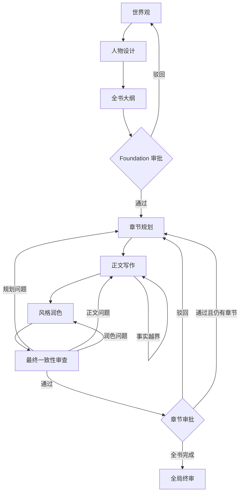

# GraphNovel

GraphNovel（番茄小说工坊）是一个面向中文网络小说创作的 AI 辅助写作系统。它使用 Graph Engineering 组织世界观、人物、大纲、章节规划、正文写作、风格润色、一致性审查、人工审批和全局终审，让长篇创作具备可追踪的状态、明确的质量门和可恢复的检查点。

项目提供本地 Web 界面和 CLI，通过 OpenAI SDK 调用 DeepSeek 兼容接口。

## Graph Engineering

GraphNovel 不是简单的 Prompt 串联。核心运行语义包括：

| 概念 | 在项目中的职责 |
| --- | --- |
| Node | 每个创作阶段由职责单一的 Agent 节点处理 |
| State | `GraphNovelState` 是跨节点共享并持久化的唯一事实来源 |
| Edge | 引擎根据输出契约、审查结果和人工决定选择后续路径 |
| Gate | Foundation 和章节正文都经过可持久化的人工审批门 |
| Loop | 格式错误、事实越界、审查失败和人工驳回进入有上限的反馈重写循环 |
| Checkpoint | 关键状态转换后保存项目，进程重启后可以继续 |



章节驳回时可以选择从规划、正文或润色节点恢复；图引擎负责路由，页面只负责触发事件和展示状态。

## 主要能力

- 生成并审批世界观、人物阵容和全书章节大纲。
- 分批生成长篇大纲，避免单次模型响应承载全部章节。
- 为每章建立因果链、前置事实、计划新增事实、信息来源和开篇承接桥。
- 始终向章节节点提供上一章结尾，同时对更早历史使用有界上下文，控制长度但不丢失直接衔接。
- 追踪 Narrative State：已批准事实、角色认知、时间地点、角色状态、资源和伏笔。
- 拦截未规划事实、知识越权、无有效来源的信息传播和章节连续性冲突。
- 先润色再执行最终一致性审查，未解决的逻辑问题不能进入人工审批。
- 按规划、正文、润色和写作契约分别记录重写次数，并选择最小必要重写范围。
- 在章节批准前隔离候选稿的事实与副作用，防止失败稿污染后续章节。
- 保存节点生命周期、条件边、错误和执行记录；中断后可复用已完成节点的持久化产物。
- 防止未批准前章之后继续生成新章，并避免同一项目被并发任务重复覆盖。
- 提供章节分页、运行状态、失败重试和已批准正文导出。

## 技术栈

- Python 3.9
- Flask 与 Jinja2
- OpenAI Python SDK（兼容自定义 Base URL）
- dataclass 与 JSON 状态持久化
- `unittest.mock` 与 Flask test client

## 快速开始

### 1. 克隆并安装

```bash
git clone https://github.com/nssntus/graph-novel.git
cd graph-novel

python3 -m venv .venv
source .venv/bin/activate
pip install -r requirements.txt
```

### 2. 配置环境

```bash
cp .env.example .env
```

在 `.env` 中填写真实的 API Key：

```dotenv
DEEPSEEK_API_KEY=your-deepseek-api-key-here
DEEPSEEK_BASE_URL=https://api.deepseek.com
DEEPSEEK_MODEL=your-supported-model
```

模型名称和能力由供应商决定，请按当前 API 文档设置 `DEEPSEEK_MODEL`。`.env` 已加入 `.gitignore`，不要将真实密钥提交到版本库。

常用可选配置：

| 环境变量 | 用途 |
| --- | --- |
| `GRAPH_NOVEL_DIR` | 小说项目存储目录，默认 `~/GraphNovel_Projects` |
| `FLASK_SECRET_KEY` | Flask 会话密钥；非本地环境必须显式设置 |
| `FLASK_HOST` | Web 监听地址，默认 `127.0.0.1` |
| `PORT` | Web 服务端口，默认 `5500` |
| `FLASK_DEBUG` | 设置为 `1` 时启用 Flask 调试模式，默认关闭 |
| `DEEPSEEK_TIMEOUT_SECONDS` | 单次模型请求超时秒数 |
| `DEEPSEEK_API_RETRIES` | API 调用重试次数 |
| `DEEPSEEK_FORMAT_RETRIES` | 结构化输出格式重试次数 |
| `DEEPSEEK_THINKING` | 供应商支持时启用或关闭思考模式 |
| `DEEPSEEK_REASONING_EFFORT` | 推理强度配置 |
| `GRAPH_NOVEL_LLM_DEBUG_FILE` | 可选的本地 LLM JSONL 诊断文件 |

### 3. 启动 Web 界面

```bash
python3 web_server.py
```

打开 [http://127.0.0.1:5500](http://127.0.0.1:5500)。未设置 API Key 时页面仍可启动，但生成任务会失败。

### 4. 使用 CLI

```bash
python3 -m graph_novel.cli \
  --title "示例小说" \
  --genre fantasy \
  --chapters 20 \
  --premise "一句话故事前提" \
  --theme "核心主题" \
  --notes "快节奏成长与团队建设"
```

无人值守运行可以增加 `--auto-approve`，但这会跳过人工审批，不建议用于正式内容生产。

## 项目结构

```text
graph_novel/
├── state.py              # State 数据模型、序列化和兼容读取
├── engine.py             # 图调度、条件边、Gate 和重写循环
├── narrative.py          # 事实、角色认知、上下文和连续性校验
├── output_contracts.py   # LLM 结构化输出契约
├── llm.py                # 统一模型调用适配层
├── exporting.py          # 已批准内容导出
├── nodes/                # 各创作与审查节点
└── web/                  # Flask API、模板和静态资源

tests/test_integration.py # Mock LLM 集成回归套件
web_server.py             # Web 启动入口
```

小说项目默认写入 `GRAPH_NOVEL_DIR`，不保存在仓库目录中。关键状态会序列化到项目目录，以便 Web 进程重启后恢复。

## 测试

```bash
python3 tests/test_integration.py
```

常规测试会 Mock LLM，不会产生真实 API 费用。回归范围包括状态序列化、旧存档兼容、输出契约、图路由、审批 Gate、失败恢复、分层重写上限、Narrative State、Web API、分页和完整 Mock 工作流。

## 数据与安全

- 小说正文、人物设定和创作状态默认保存在本机项目目录，不应提交到本仓库。
- API Key 只应通过环境变量或未跟踪的 `.env` 提供。
- LLM 调试日志可能包含 Prompt、模型响应和小说内容，应保存在受控的本地路径。
- Web 默认只监听 `127.0.0.1` 且关闭调试；对外部署前仍需增加身份认证、访问控制并设置独立的 `FLASK_SECRET_KEY`。
- 对模型输出始终执行结构校验，但生成内容仍需要人工审阅。

## 当前边界

- 这是本地开发项目，不包含生产级部署、身份认证或多租户隔离。
- 模型可用性、名称和能力由外部供应商决定，运行前应核对当前 API 文档。
- 长篇小说质量仍受模型、上下文长度和人工反馈质量影响。
- 只有通过人工审批的章节才会提交叙事状态并进入正式导出。
