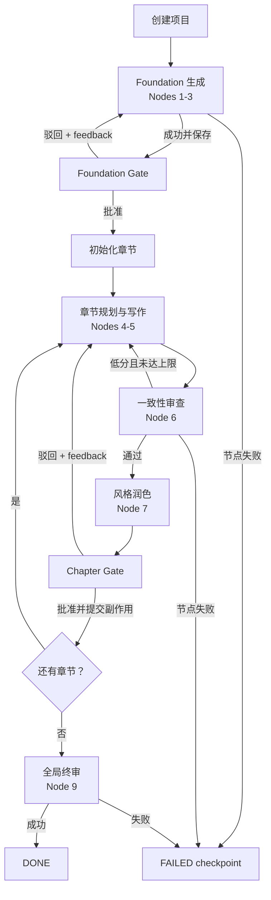

# GraphNovel 改造与修复计划

**状态**：批次 0–4 完成；下一批为 LLM 输出契约与供应商适配
**制定日期**：2026-07-27  
**原则**：先恢复正确性，再增强图运行时，最后优化模型质量和体验。

## 目标

把当前“具备 Graph Engineering 语义的原型”改造成：

- 图状态真实、可持久化；
- 节点失败不会被伪装成成功；
- 人工审批可以暂停和恢复，不阻塞 HTTP 请求等待用户；
- 驳回与低分重写沿明确的反馈边执行；
- 重写不会污染全局人物弧线、伏笔或既有章节数据；
- 服务重启后能够识别项目所处阶段；
- Mock 流程可靠，真实模型能力单独验证；
- 在没有明确收益前，不进行大规模框架迁移。

## 当前基线

- Python 3.9.6。
- 原始回归基线为 9 项；当前 Mock 集成测试为 18 项。
- 现有测试全部使用 Mock LLM，未验证真实 DeepSeek API。
- 已建立 Git 基线；核心改造按可回滚批次提交。
- Foundation Gate、Chapter Gate、重写反馈与批准后副作用提交均已持久化。

## 已确认的高优先级问题

| 优先级 | 问题 | 影响 |
|---|---|---|
| P0 | Web 线程在审批回调中等待，同时请求 `join(120/180)` | 用户需长时间等待，审批流程逻辑互锁 |
| P0 | 节点失败后 API 仍可能返回 `success: true` | UI 与持久化状态不可信 |
| P0 | Foundation 驳回没有可靠的反馈重生成路径 | Graph Edge 与界面承诺不一致 |
| P0 | 章节规划会直接替换 `Chapter` | 重写可能丢失反馈、审批和历史产物 |
| P0 | 低分重写没有把审稿问题真正传回规划/写作 | 循环存在，但反馈边没有数据 |
| P1 | 创建表单的 `genre`、`premise`、`theme` 未进入 State/Prompt | 用户核心创意被丢弃 |
| P1 | 写作和审稿在人工批准前更新全局伏笔、人物弧线 | 驳回/重写会重复或污染全局状态 |
| P1 | 引擎阶段和待审批 Gate 主要保存在内存 | 服务重启后无法可靠恢复 |
| P1 | 同一项目可被重复触发并发执行 | 多个线程可能覆盖同一个 State |
| P2 | LLM JSON 只做宽松正则提取，缺少契约校验 | 畸形输出可能进入后续节点 |
| P2 | 模型名称和真实 API 能力未核验 | 实际调用可能失败 |

## 目标图行为

## 实施批次

### 批次 0：安全基线

目标：在修改核心状态机前建立可回退、可复现的基线。

任务：

- [x] 经用户确认后初始化 Git，并提交当前基线。
- [x] 完善 `.gitignore`，排除 `.env`、`.venv`、`.DS_Store`、缓存和运行产物。
- [x] 保留现有 9 项测试作为回归基线。
- [x] Web 测试统一把 `GRAPH_NOVEL_DIR` 指向临时目录。
- [x] 为已确认的 P0 行为先添加失败测试。

成功标准：

- 基线可回滚；
- 测试不读写用户正式项目目录；
- 新测试能够稳定复现审批阻塞之外的状态错误，不调用真实 LLM。

### 批次 1：修正 State 与用户输入

目标：让 State 能表达真实创作意图、当前阶段和人工 Gate。

候选 State 字段：

- `creative_genre`
- `creative_premise`
- `creative_theme`
- `workflow_phase`
- `pending_gate`
- `foundation_approval`
- `foundation_feedback`
- `last_error`

任务：

- [x] 保存创建表单的 genre、premise、theme、目标字数和目标章数。
- [x] Foundation 节点 Prompt 明确使用这些字段。
- [x] 为工作流阶段、待审批 Gate 和错误提供可序列化字段。
- [x] 将 State `version` 升级，并保证旧版存档缺少新字段时使用安全默认值。
- [x] 明确“用户目标章数”和“模型实际生成章数”的校验规则。

成功标准：

- 创建项目后保存并重载，所有用户输入无丢失；
- 旧版 State 仍能加载；
- 页面和 API 能从持久化 State 判断当前阶段与待审批项。

### 批次 2：把 Engine 改造成可暂停的图执行器

目标：生成与人工决策分离，Engine 成为状态转换的唯一负责人。

任务：

- [x] 将 Foundation 的“生成 Nodes 1-3”和“Node 8 决策”拆成两个 Engine 动作。
- [x] 将章节的“生成 Nodes 4-7”和“Node 8 决策”拆成两个 Engine 动作。
- [x] 每次执行到 Gate 时保存 State 并立即返回，不在 Engine/Web 中等待用户。
- [x] 批准、驳回、低分、节点失败分别对应显式转换。
- [x] 保留 CLI 交互，但让 CLI 通过同一组 Engine 动作驱动，不复制图规则。
- [x] 节点失败时停止下游调度，并记录失败节点和可恢复位置。

成功标准：

- Foundation 生成结束后状态为等待审批，请求不等待审批事件；
- 批准后进入章节阶段；
- 驳回后反馈被保存，并沿 Foundation 反馈边重新生成；
- 任一节点失败后下游节点不执行，API 不返回成功。

### 批次 3：修复章节重写与副作用

目标：让自动重写和人工驳回重写成为真正的数据反馈循环。

任务：

- [x] 章节规划更新既有 `Chapter`，不无条件替换整个对象。
- [x] 自动重写时把上一轮 `consistency_report.issues` 传给规划和写作节点。
- [x] 人工驳回时把 `human_feedback` 传给下一轮规划和写作节点。
- [x] 写作节点先保存候选 META，不立即提交人物弧线和伏笔副作用。
- [x] 仅在章节批准时幂等提交弧线、伏笔和章节钩子等全局副作用。
- [x] 明确自动重写次数和人工重写次数的记录方式。

成功标准：

- 低分第二稿 Prompt 中包含第一稿问题；
- 人工驳回后的新稿包含人工反馈上下文；
- 重写不会重复增加伏笔或提前推进人物弧线；
- 批准操作重复提交也不会重复应用副作用；
- 原稿、当前稿和必要反馈至少有可追溯关系。

### 批次 4：Web 任务生命周期与并发保护

目标：让耗时 LLM 节点异步运行，并使 UI 获得真实进度。

任务：

- [x] 为运行操作返回 `202 Accepted` 和任务状态，而不是长时间 `join`。
- [x] 增加项目级运行锁，拒绝同一项目的冲突任务。
- [x] API 区分 `idle`、`running`、`awaiting_approval`、`failed`、`completed`。
- [x] 前端轮询项目/任务状态，展示当前节点、失败原因和可执行动作。
- [x] 服务重启时依据 checkpoint 恢复为安全状态；不把丢失的线程视为仍在运行。
- [x] 清理完成的内存任务和审批事件，避免长期泄漏。

成功标准：

- 启动生成请求快速返回；
- 重复点击不会启动第二条冲突执行流；
- UI 可看到真实节点进度和失败状态；
- 重启后仍能审批已完成生成的 Foundation 或章节。

说明：第一版优先使用标准库和持久化 State，不立即引入 Celery、Redis 等基础设施。

### 批次 5：LLM 输出契约与供应商适配

目标：提高节点输出可预测性，隔离外部模型变化。

任务：

- [ ] 为各节点定义明确的响应 Schema 和字段校验。
- [ ] 将重复的 JSON 提取、序列化和错误处理收敛到共享工具。
- [ ] 对可恢复的格式错误实施有限次数的结构修复/重试。
- [ ] 模型、base URL、超时和有限重试策略改为统一配置。
- [ ] 核验 DeepSeek 官方 API 当前支持的模型和参数。
- [ ] 在用户授权的 API 费用范围内运行最小真实 smoke test。

成功标准：

- 缺字段、错误类型、非法分数和错误章节数能在节点边界被拒绝；
- 常规测试仍完全 Mock，不产生费用；
- 真实 smoke test 的模型、时间和结果被明确记录。

### 批次 6：可观察性、质量与体验

目标：在核心图可靠后提高诊断能力和创作体验。

任务：

- [ ] 记录每次运行的节点、开始/结束时间、耗时、路由决定和错误摘要。
- [ ] 为 Prompt/响应保留可控、脱敏、可选的调试记录。
- [ ] 修正创建表单、审批按钮、驳回重写和导出中的中英文不一致。
- [ ] 增加完整 Web 流程测试和必要的浏览器验证。
- [ ] 核对字数、章节数、导出文件名和全局终审前置条件。
- [ ] 核心执行稳定后，再评估是否引入显式图框架。

成功标准：

- 能从项目状态解释“当前在哪个节点、为什么走这条边、失败在哪里”；
- 核心 Foundation → Chapter → Review 流程可在 Mock 环境端到端通过；
- 真实模型测试与 Mock 测试结果明确区分。

## 暂不做

在 P0/P1 问题修复前，不进行以下工作：

- 不迁移到 LangGraph 或其他图框架；
- 不引入 Celery、Redis、数据库或消息队列；
- 不重写全部前端；
- 不批量重构所有 Prompt；
- 不升级 Python 或全量升级依赖；
- 不把单用户本地原型直接扩展成多租户生产系统。

这些方向只有在稳定状态机暴露出明确需求后再单独评估。

## 推荐开工顺序

第一轮实施建议限定为一个闭环：

1. 建立 Git/测试安全基线；
2. 写入并持久化用户创作输入；
3. 拆分 Foundation 生成与审批；
4. 让 Foundation API 在生成后返回 `awaiting_approval`；
5. 覆盖批准、驳回、节点失败和旧 State 加载测试；
6. 运行完整 Mock 回归后停止并交付。

第一轮不同时改章节重写和异步任务系统，以控制变更面。Foundation 闭环稳定后，再用同一模式改造章节管线。

## 验证记录

每一批实施完成后在此追加：

- 完成的任务；
- 测试命令与结果；
- 是否调用真实 API；
- 发现但未处理的风险；
- 下一批入口条件。

### 2026-07-27：第一轮 Foundation 闭环

- 完成批次 0 和批次 1。
- Foundation 生成与审批已拆分；生成到 Gate 后持久化并返回，不再等待审批事件。
- Foundation 批准、驳回、重复决策和节点失败已形成显式状态转换。
- 驳回反馈会进入下一轮世界观、人物和大纲 Prompt。
- State 升级到 v2，并修复 `Dict[str, Enum]` 反序列化问题。
- 项目存档使用真实 `project_id` 文件名，同时兼容旧 `graph_novel_state.json`。
- 基础测试从 9 项扩展到 13 项：`python3 tests/test_integration.py`，13/13 通过。
- 浏览器验证待生成、已批准和首页进度状态通过；驳回页面由 Flask 渲染测试覆盖。
- 未调用真实 DeepSeek API。
- 下一批入口：按相同模式拆分章节生成与 Chapter Gate，并修复重写反馈和副作用提交时机。

### 2026-07-27：第二轮 Chapter Gate 与重写闭环

- 完成批次 2 剩余任务和批次 3。
- Nodes 4–7 生成结束后持久化 `chapter:<n>` Gate 并返回；Node 8 的批准/驳回通过独立 Engine 动作恢复图。
- 自动低分重写与人工驳回均保存反馈和历史稿，并把反馈送回章节规划、写作节点。
- 候选 META、人物弧线和伏笔不再生成即生效；只在批准时使用稳定 ID 幂等提交。
- State 升级到 v3，并为旧版已批准章节和待审批章节提供迁移规则。
- 章节导出和完成进度仅统计已批准稿件，未批准稿不进入完整小说。
- Node 9 仅允许在全部章节批准后运行，失败会进入 `FAILED checkpoint`，Web API 不再把失败报告为成功。
- Mock 集成测试扩展到 17 项：`python3 tests/test_integration.py`，17/17 通过。
- 浏览器验证章节进度、批准稿/待写稿状态和已批准稿详情通过。
- 未调用真实 DeepSeek API。
- 已知风险：章节生成仍在 HTTP 请求内同步执行；同一项目也尚无运行锁，留到批次 4 统一处理。
- 下一批入口：实现持久化任务状态、项目级运行锁、快速返回和前端轮询。

### 2026-07-27：第三轮 Web 任务生命周期与并发保护

- 完成批次 4。
- State 升级到 v4，以 `active_task` 持久化任务 ID、类型、状态、时间和错误；内存线程不作为业务事实源。
- Foundation、章节生成和全局终审启动接口统一返回 `202 Accepted`，由后台线程执行。
- 新增项目级非阻塞锁；同一进程内重复启动或运行中审批返回 `409 busy`。
- 新增 `GET /api/<project_id>/task-status`，统一暴露 `idle`、`running`、`awaiting_approval`、`failed`、`completed`。
- Foundation、章节、终审和项目面板使用共享轮询脚本，刷新页面后可继续观察当前任务。
- 服务重启时，已落到 Gate 或完成的任务恢复对应终态；真正中断的 `running` 任务转为可重试的 `failed`。
- 后台线程结束后会清理线程句柄；审批等待事件已不再存在。
- Mock 集成测试为 18 项：`python3 tests/test_integration.py`，18/18 通过。
- 浏览器验证中断恢复提示、重试入口、批准章节进度和四个页面的状态轮询通过。
- 未调用真实 DeepSeek API。
- 已知边界：当前项目锁是单 Flask 进程内互斥；未来若改为多进程或多实例部署，需要文件锁、数据库锁或任务队列。
- 下一批入口：收敛节点 JSON Schema、共享解析与有限结构修复，然后核验 DeepSeek 当前官方模型参数。
